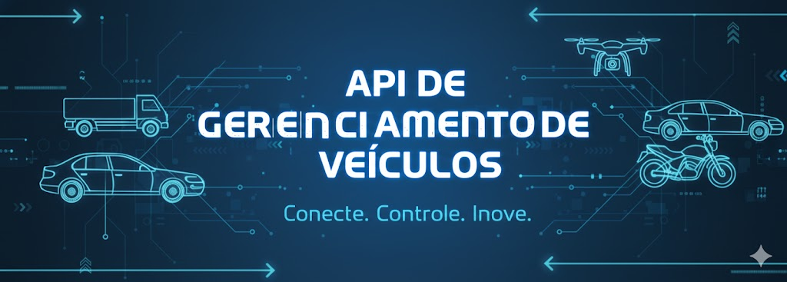

<p align="center">
  
</p>


 
 


Esta é uma API simples para gerenciar informações sobre veículos, construída com Python, Flask, PostgreSQL e Docker. A API permite adicionar, **visualizar**, **atualizar** e **excluir** registros de veículos.

## 📌 Índice

- [**Tecnologias Utilizadas**](#tecnologias-utilizadas)
- [**Como Executar**](#como-executar)
- [**Endpoints da API**](#endpoints-da-api)
    - [**GET** : Obter todos os veículos](#get)
    - [**POST** : Adicionar um novo veículo](#post)
    - [**PUT** : Atualizar informações de um veículo](#put)
    - [**DELETE** : Deletar um veículo](#delete)
    

## <a id="tecnologias-utilizadas"></a> 🛠️ Tecnologias Utilizadas

- Python
- PostgreSQL
- Docker


## <a id="como-executar"></a> 🚀Como Executar o Projeto

### Pré-requisitos:
- **Docker**: Para executar o projeto .
- **Insomnia ou similar**: Para fazer os diferentes tipos de requisição

### 1. Clone o repositório

Primeiro, clone este repositório para a sua máquina:

```bash
git clone https://github.com/[seu-usuario]/gestao-pizzaria.git

```
Navegue até a raiz do projeto
```bash
cd veiculos-api
```

### Usando Docker

1. **Certifique-se de ter o Docker e o Docker Compose instalados.**

2. **Execute o seguinte comando para construir e iniciar os containers:**
   ```bash
   sudo docker-compose up --build
   ```

A API estará disponível em `http://127.0.0.1:5000/vehicles`.

## <a id="endpoints-da-api"></a> 🌐 Endpoints da API

Você pode testar todos os endpoints usando o **Insomnia** ou ferramentas similares como Postman. Abaixo estão os detalhes de cada operação:

### <a id="get"></a> 1. Obter todos os veículos

```http
GET: http://127.0.0.1:5000/vehicles
```
Este endpoint retorna uma lista de todos os veículos registrados na base de dados.

**Exemplo de resposta:**
```json
{
    "vehicles": [
        {
            "id": 1,
            "make": "Fabrica",
            "model": "Modelo X",
            "year": 2020
        },
        {
            "id": 2,
            "make": "Fabrica",
            "model": "Modelo Y",
            "year": 2021
        }
    ]
}
```
### <a id="post"></a> 2. Adicionar um novo veículo
```http
POST: http://127.0.0.1:5000/vehicles
```
Este endpoint permite adicionar um novo veículo. O corpo da requisição deve conter os seguintes campos:

```make```: Marca do veículo
```model```: Modelo do veículo
```year```: Ano do veículo

**Exemplo de corpo da requisição:**
```json
{
    "make": "Fabrica",
    "model": "Modelo Z",
    "year": 2022
}
```
**Exemplo de resposta:**
```json
{
    "id": 3
}
```

### <a id="put"></a> 3. Atualizar informações de um veículo
```http
PUT: http://127.0.0.1:5000/vehicles/<int:id>
```
susbtítua o ```<int:id>``` para o número de um index.

Este endpoint atualiza as informações de um veículo existente. O id do veículo deve ser passado na URL, e o corpo da requisição pode conter os campos a serem atualizados.

**Exemplo de corpo da requisição:**
```json
{
    "make": "Nova Fabrica",
    "model": "Modelo Atualizado",
    "year": 2023
}
```

**Exemplo de resposta:**
```json
{
    "message": "Vehicle updated"
}
```

### <a id="delete"></a> 4. Deletar um veículo
```http
DELETE: http://127.0.0.1:5000/vehicles<int:id>
```
susbtítua o ```<int:id>``` para o número de um index.
Este endpoint remove um veículo da base de dados. O id do veículo deve ser passado na URL.

**Exemplo de resposta:**
```json
{
    "message": "Vehicle deleted"
}
```
